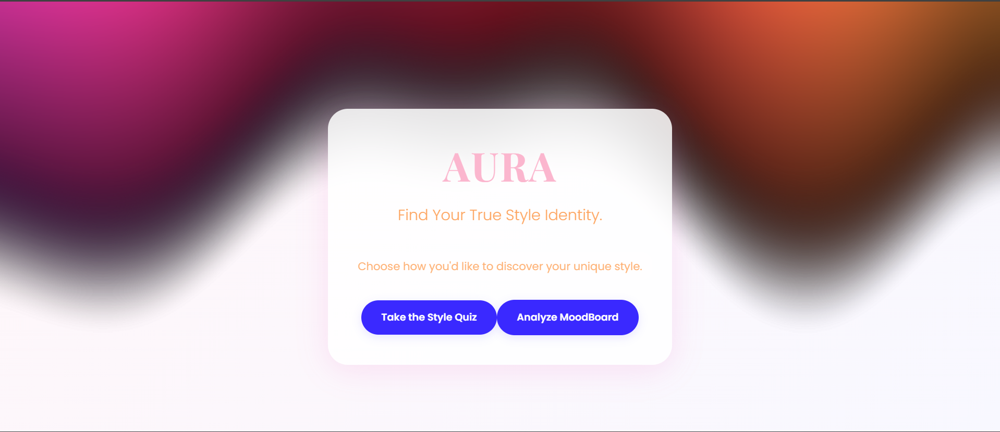
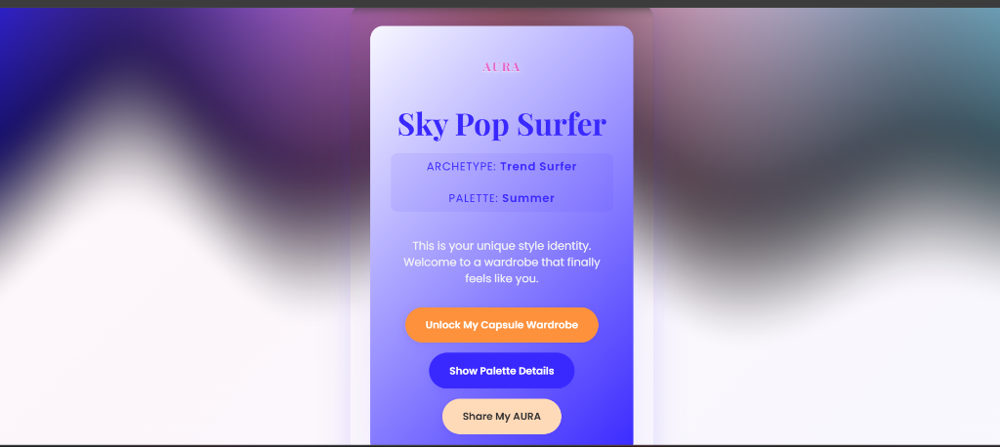
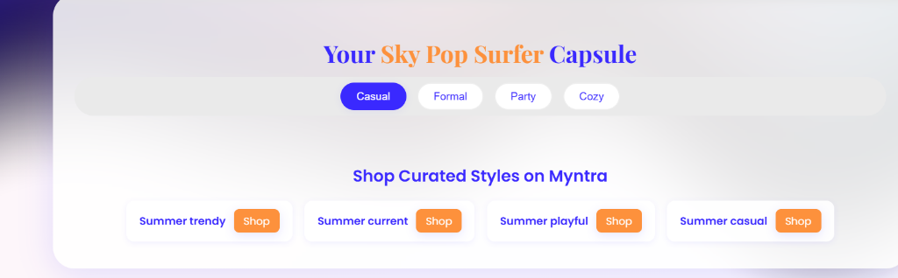

# ✧ AURA ✧
### *Personalized Style, Decoded by AI.*

[](https://github.com/DiyaMittal02/AURA)
[](https://www.python.org/)
[](https://reactjs.org/)
[](https://pytorch.org/)

## 📱 Application Preview

| Landing Page | Style DNA Quiz | Palette Scanner |
| :---: | :---: | :---: |
|  |  |  |

---

## 🌟 Overview

**AURA** is a next-generation fashion discovery platform that moves beyond generic recommendations. By fusing **Computer Vision (AI)** with **Style Psychology**, AURA creates a deeply personalized shopping experience that understands both your physical attributes and your unique personality.

### The Problem
Most fashion platforms recommend products based on "what others bought." This ignores two critical factors:
1. **Skin Tone & Color Harmony**: Traditional search doesn't know which colors make you glow and which make you look washed out.
2. **Style Archetype**: Your fashion choice isn't just about utility; it's an expression of your personality axes (Tradition vs. Innovation, Function vs. Expression).

### The Solution: AURA
AURA analyzes your features and your mindset to place you into one of **64 Unique Style Personas**, delivering a curated feed that feels like it was handpicked by a professional stylist.

---

## 🚀 Key Features

### 1. 📷 Palette Scanner (AI-Powered)
Using a custom-trained **ResNet18 Deep Learning model**, AURA analyzes your uploaded photo to determine your **Seasonal Color Palette**.
- **Spring**: Warm, light, and vibrant.
- **Summer**: Cool, light, and muted.
- **Autumn**: Warm, deep, and earthy.
- **Winter**: Cool, deep, and high-contrast.

### 2. 🧠 Style DNA Quiz
A psychometric-inspired quiz that maps your personality across 4 key axes:
- **Tradition vs. Experimental**
- **Function vs. Expressive**
- **Minimal vs. Statement**
- **Casual vs. Polished**

### 3. 🧪 Persona Fusion
The magic happens when your **Color Season** meets your **Base Archetype**. AURA blends these to create 64 distinct personas like:
- *Solar Flare Rebel* (Spring + Edgy Rebel)
- *Midnight Steel Minimalist* (Winter + Minimal Classic)
- *Amber Stone Muse* (Autumn + Soft Creative)

### 4. 🛍️ Dynamic Curated Feed
A personalized storefront that filters products not just by category, but by your **Persona Tags** and **Occasion Context**, ensuring every recommendation is "on-brand" for you.

---

## 🧪 The AURA Logic: 64 Unique Personas

AURA uses a dual-engine approach to personalization:

### Engine A: The Color Harmony Engine
The AI Service classifies users into four seasonal palettes based on skin, eye, and hair color harmony:
- **🌸 Spring**: Warm & Bright
- **☀️ Summer**: Cool & Muted
- **🍂 Autumn**: Warm & Muted
- **❄️ Winter**: Cool & Bright

### Engine B: The Style DNA Engine
The quiz calculates scores across 4 psychological axes to determine one of **16 Base Archetypes**:
- *Examples*: Minimal Classic, Edgy Rebel, Ethereal Nomad, Futurist.

**Final Persona = [Color Season] + [Base Archetype]**
*Example: A "Winter" + "Sleek Professional" becomes an **Onyx Power Executive**.*

---

## 🛠️ Tech Stack

| Layer | Technology |
| :--- | :--- |
| **Frontend** | React.js, Vite, Framer Motion, Vanilla CSS |
| **Backend** | Node.js, Express.js |
| **AI/ML Service** | Python, Flask, PyTorch, Torchvision |
| **Image Processing** | PIL (Python Imaging Library) |

---

## 📂 Project Structure

```text
AURA/
├── aura-frontend/      # React + Vite frontend application
├── aura-backend/       # Node.js Express server (Orchestrator)
└── aura-palette-ai/    # Flask server + PyTorch Model (AI Service)
```

---

## ⚙️ Installation & Setup

To run AURA locally, you need to start three separate services.

### 1. AI Service (Python)
```bash
cd aura-palette-ai
pip install -r requirements.txt
python api.py
```
*Runs on `http://localhost:5001`*

### 2. Backend Orchestrator (Node.js)
```bash
cd aura-backend
npm install
node server.js
```
*Runs on `http://localhost:3001`*

### 3. Frontend (React)
```bash
cd aura-frontend
npm install
npm run dev
```
*Runs on `http://localhost:5173`*

---

## 🧠 System Architecture

1. **Frontend** captures a user image and quiz responses.
2. **Backend** routes the image to the **AI Service**.
3. **AI Service** returns a seasonal classification (e.g., "Winter").
4. **Backend** calculates the **Style Archetype** from quiz scores and performs **Persona Fusion**.
5. **Frontend** displays the unique persona and a curated feed of matching products from the mock catalog.

---

## 🚀 Future Roadmap
- [ ] **Virtual Try-On**: Integration with AR to see persona-matched outfits.
- [ ] **Real-time Trend Mapping**: Syncing with Myntra's live trend data.
- [ ] **Social Sharing**: Exporting "Style DNA" cards for social media.
- [ ] **Advanced Face Masking**: Improving AI accuracy by isolating skin segments.

---

## 🎨 UI Aesthetics
AURA features a premium, luxe design inspired by high-end fashion magazines:
- **Aurora Effects**: Dynamic, flowing background gradients.
- **Glassmorphism**: Sleek, transparent UI components.
- **Micro-animations**: Smooth transitions using Framer Motion.

---

## 🤝 Authors
- **Diya Mittal** - [GitHub](https://github.com/DiyaMittal02)

---

> Developing the future of fashion discovery at the intersection of AI and Human Expression. ✧
